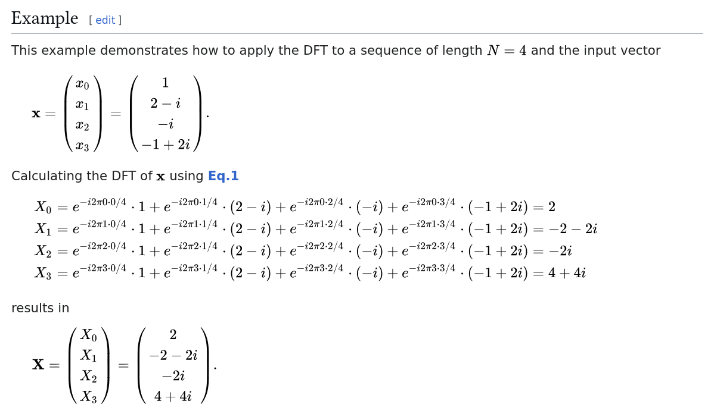
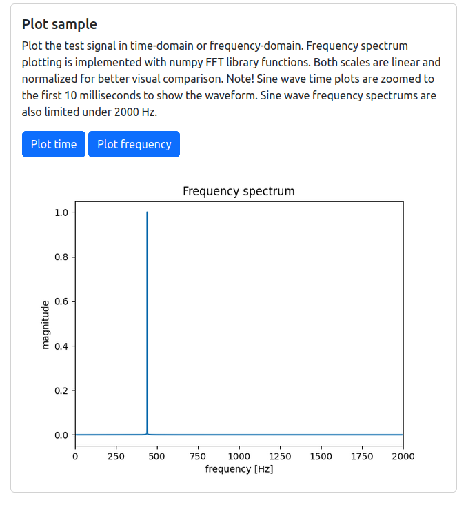

# Implementation

## DFT and FFT
Discrete Fourier Transform transforms a sequence of samples in time-series to a sequence of frequency components. The definition of DFT and the following example are from Wikipedia.

Fast Fourier Transform FFT is an algorithm to compute DFT faster. DFT requires O(n²) operations, while FFT as a divide-and-conquer algorithm requires O(n log n) operations. Cooley-Tukey algorithm splits the sample sequence to even and odd indexes recursively and computes the DFTs of the size 2 sequences. Then the algorithm merges the result back to the original length applying the twiddle factors to the DFTs.

## Structure of the program
The program code structure is simple: app.py runs the Flask application and fft.py and sounds.py modules contain the functions used in the program. There are also some static wav files used as inputs to the FFT algorithms.

fft.py contains the core FFT algorithms, both numpy versions and the Cooley-Tukey implementation. sounds.py module contains helper functions from different python libraries e.g. for generating signals, converting sampling rate, converting frequencies to note names and plotting.

## UI and program features
The program has three features: choose sound sample, plot the selected sample and detect the pitch from the sample.

Sine waves are generated in the program, with or without noise. Sine wave is a pure sine wave with frequency 440 Hz. Harmonic sine waves have frequencies 440 Hz, 880 Hz and 1320 Hz. Sine wave with some noise is 440 Hz pure sine wave plus amplitude 10 random noise, and sine wave with lots of noise has amplitude 50 random noise. Audio samples are musical instrument samples from University of Iowa Electronic Music Studios collection. Each sample contains only one note played by one instrument. The samples were converted to 2 second wav files with Audacity. 

Plotting feature is implemented with numpy and matplotlib.pyplot libraries. The selected sample can be plotted in time-domain or frquency-domain. Frequency spectrum is plotted with numpy's fft.rfft function, which is for real valued signals and returns only the positive frequency components of the symmetric spectrum. Then we take absolute value np.abs of the FFT output, which is complex, and get the magnitudes of each frequency components.

Pitch detection feature is implemented with Cooley-Tukey based FFT algorithm without numpy functions and arrays. First we need to convert the sound sample to a list, if it is a numpy array. Then we give the list to fft function as an input and the function returns the whole frequency spectrum of complex numbers, as well in a list form. Finally we give the list of frequency components as an input to the fundamental_frequency_fft function, which selects the positive frequencies, takes absolute values and returns the peak frequency as a result.

## Improvements
There are two clear improvements that could be implemented in the code. First of all, the fft only accepts samples in size of power of two. If we try anything else, the list indexing when combining the frequency component lists gives an error.

The other improvement is related to the pitch detection accuracy. Because of the simple implementation, for example the guitar audio sample pitch can't be detected. Using more advanced methods might resolve that.

## Use of large language models
ChatGPT was used in this project:
- researching and explaining the background of signal processing and related math
- researching python libraries and describing their functions and parameters, for example numpy, matplotlib.pyplot and librosa
- generating test signals
- UI programming and plotting with Flask

## Sources
- Wikipedia DFT: https://en.wikipedia.org/wiki/Discrete_Fourier_transform
- University of Iowa Electronic Music Studios: https://theremin.music.uiowa.edu/mis.html

