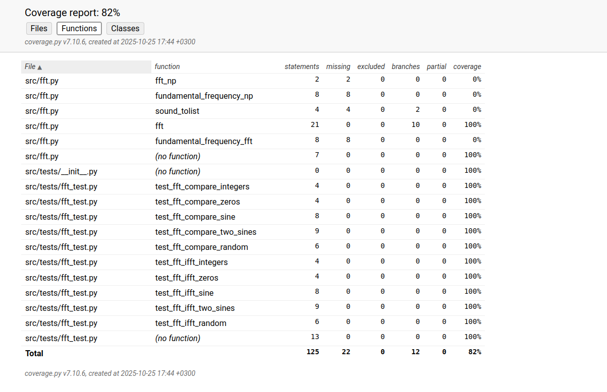

# Testing

## Unit testing coverage report

## fft module unit tests

Tested comparing the fft function and numpy fft function outputs with np.allclose function, with relative tolerance between elements 1e-5 and absolute tolerance between elements 1e-8.

Verified the results with several inputs: 
- integers [1,2,3,4]
- zeros [0,0,0,0]
- sine wave (length 16384 * 2)
- sum of two different sine waves (length 16384 * 2)
- normally distributed random numbers (length 16384 * 2)

Tested applying the fft function to the test signal and then applying the numpy ifft function to the fft result. Comparing ifft result to the original signal with np.allclose function, with relative tolerance between elements 1e-5 and absolute tolerance between elements 1e-8.

Verified the results with several inputs: 
- integers [1,2,3,4]
- zeros [0,0,0,0]
- sine wave (length 16384 * 2)
- sum of two different sine waves (length 16384 * 2)
- normally distributed random numbers (length 16384 * 2)

